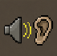

# Always Hear Drops

RuneLite plugin that plays the game's item drop sound for valuable and untradeable drops, even when your in-game Sound Effects volume is muted.

Uses RuneLite's `playSoundEffect(id, volume)` API which plays through the OS sound system independently of the game's volume sliders.

## Features

- Works out of the box — enables automatically for all valuable drops
- Supports both tradeable (Valuable drop:) and untradeable (Untradeable drop:) notifications
- Configurable minimum coin value threshold
- Configurable volume (0–100), independent of in-game settings
- No bundled audio files — replays the game's own native item-drop sound

## Configuration

- **Enabled** – Master toggle (default: ON).
- **Minimum value** – Minimum coin value of a valuable drop to trigger the sound. Set to 0 for all valuable drops (default: 0).
- **Untradeable drops** – Also play sound for untradeable drops (default: ON).
- **Volume** – Volume of the replayed drop sound (0–100, default: 100).

## Notes

- Requires OSRS's "Loot drop notifications" setting to be enabled in-game (Settings > Chat > Loot drop notifications).
- The "Minimum item value needed for loot notification" in OSRS settings should be set to your desired threshold (or lower than this plugin's threshold for it to work).
